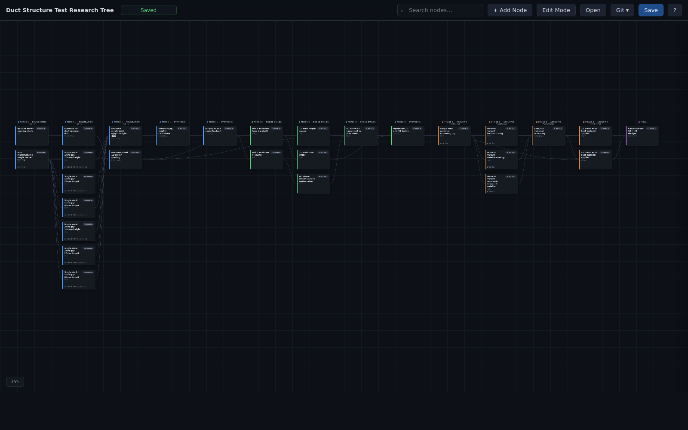
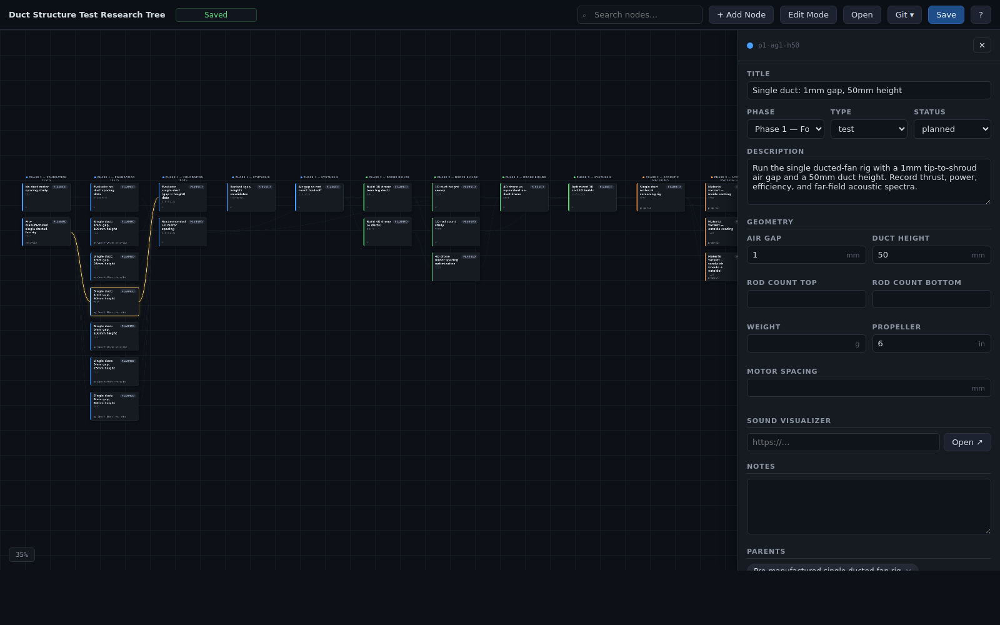
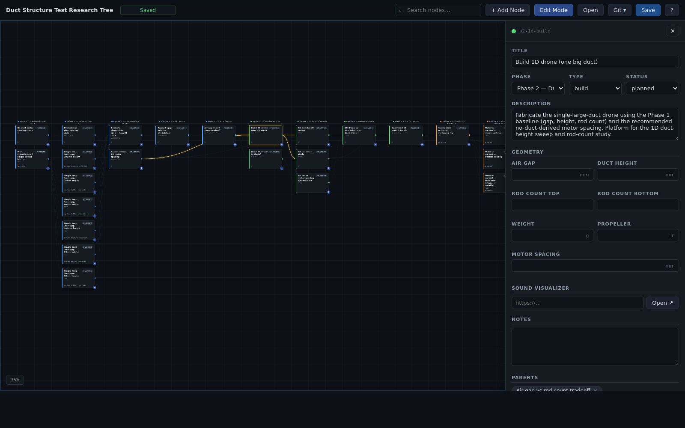
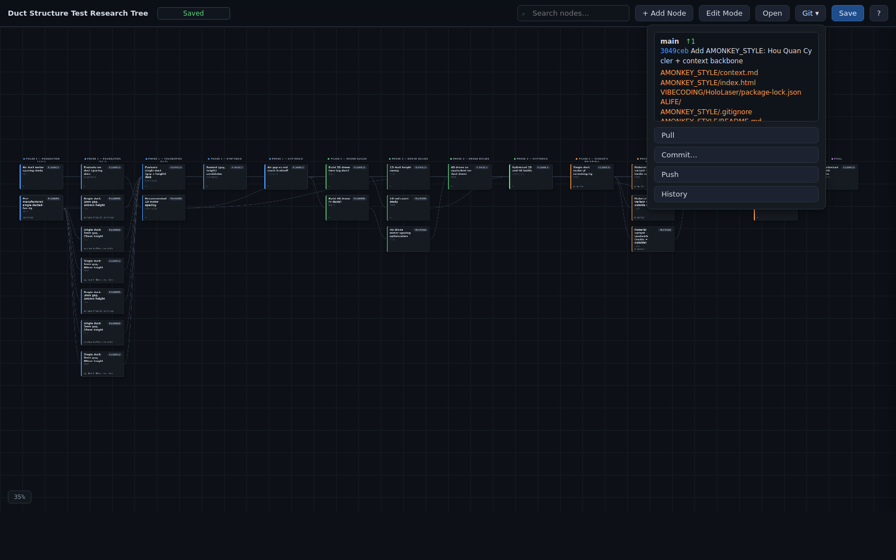

# research_tree

A left-to-right research tree editor in one HTML file. Built for the **Shroud_Comparison** duct/shroud drone test program, but you can fork it for any multi-phase test plan you want to model as a DAG.



Each node is a test, build, synthesis, or decision. Nodes carry geometry (gap, height, rod count, weight, propeller, motor spacing) and an optional link out to a separate sound-visualizer tool where the acoustic/performance numbers live. Git is the durable history — every save commits to `data.json`.

---

## 30-second quickstart

You need: a recent **Python 3**, **git**, and a Chromium-family browser (Chrome / Edge / Brave). On Linux/macOS:

```bash
git clone https://github.com/asdfgh0318/zycie.git
cd zycie/PRACA/Shroud_Comparison/research_tree
python3 serve.py
```

Then open <http://127.0.0.1:8123/> in your browser. That's it.

Click any node to open its side panel. Edit fields → click **Save** in the toolbar to write back to `data.json`. When you're happy with a batch of edits, hit **Git ▾ → Commit…** and write a one-line message — that becomes a real git commit.

---

## What you'll see

**The tree.** Phases are columns, dependencies are bezier curves, scroll-drag to pan, mousewheel to zoom.

**The node card.** Phase color stripe on the left, full title at the top, status pill, monospace geometry summary at the bottom. Click to open the side panel; right-click for a context menu.



**Edit Mode.** Toggle from the toolbar — gives you `+` add-child handles and link-handle dots for drag-to-connect.



**Git panel.** Status, pull, commit, push, history — all without leaving the page.



---

## Full manual

A 19-page illustrated PDF lives at [`manual/manual.pdf`](manual/manual.pdf). It walks through every interaction with screenshots and explains the schema, the launcher, troubleshooting, and how to extend the tree to your own project.

---

## What's in the folder

| File | What it does |
|---|---|
| `index.html` | The editor. Single file, vanilla JS, no build step. |
| `data.json` | Your tree. Source of truth. Commit it for history. |
| `serve.py` | Tiny Python server. Stdlib only. Adds `/api/git/{status,pull,commit,push,log}` for the in-page Git buttons. |
| `research_tree` | Bash launcher (`research_tree -duct`). **Note**: the registry inside it uses an absolute path — edit it for your own clone, or just run `python3 serve.py` directly. |
| `manual/` | Illustrated PDF manual + source + rebuild scripts. |
| `CLAUDE.md` | Notes for the next person (or AI) hacking on this. |

---

## Use it for your own research

The tree shape is implicit — the layout is purely a function of which node lists which other node as a parent. So to make your own tree:

1. Edit `data.json`. Change `title`, replace the `phases` list with your own, replace the `nodes` list.
2. Each node needs: `id` (kebab-case), `phaseId`, `title`, `type` (`test|build|synthesis|decision`), `status` (`planned|in-progress|done|blocked`), `parents` (list of other node ids), `geometry` block (all keys present, use `null` where not applicable), `soundVisualizerLink`, `notes`.
3. Reload the page. Done.

Schema example for one node:

```json
{
  "id": "p1-ag1-h50",
  "phaseId": "phase1",
  "title": "Single duct: 1mm gap, 50mm height",
  "description": "Pre-manufactured ducted-fan rig at ag=1mm, h=50mm.",
  "type": "test",
  "status": "planned",
  "parents": ["p1-single-duct-rig"],
  "geometry": {
    "airGapMm": 1, "ductHeightMm": 50,
    "rodCountTop": null, "rodCountBottom": null,
    "weightG": null, "propellerInches": 6, "motorSpacingMm": null
  },
  "soundVisualizerLink": "",
  "notes": ""
}
```

The editor will auto-pick column = `1 + max(depth(parents))`, so you don't position anything by hand.

---

## Troubleshooting

- **Git buttons are disabled.** You opened `index.html` via `file://`. Start `python3 serve.py` and use the `http://127.0.0.1:8123/` URL instead.
- **Save downloaded a file instead of writing in place.** Firefox doesn't support the File System Access API. Use `serve.py` (and the in-page Save will write through), or switch to a Chromium-family browser.
- **Pull failed: not a fast-forward.** Server refuses to auto-resolve merge conflicts. Resolve from the terminal: `git pull`, fix, commit, then **Push** from the editor.
- **`research_tree -duct` doesn't work.** The launcher has an absolute path for the project author's machine. Either edit the `TREES` registry inside the script, or just `cd` into the folder and run `python3 serve.py`.

---

## License

Bring your own. The original author hasn't picked one yet — assume "ask before redistributing" until that changes.
